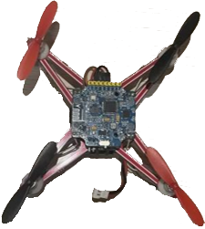
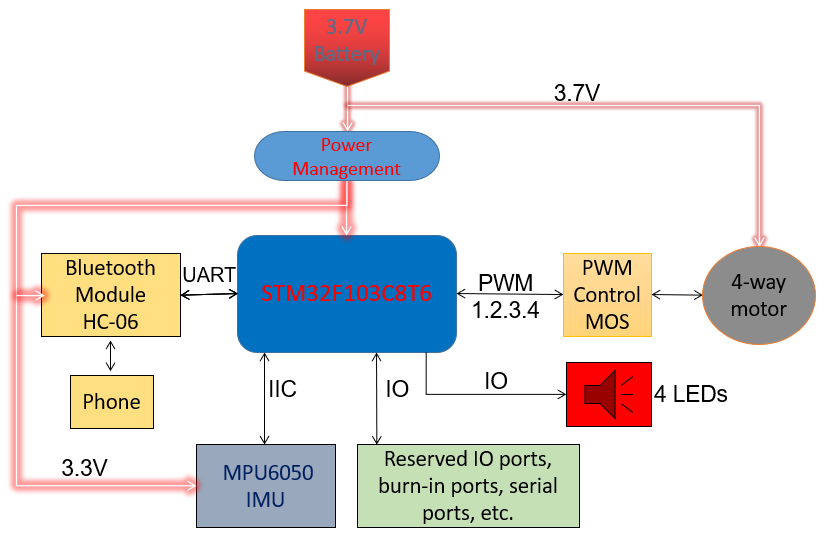
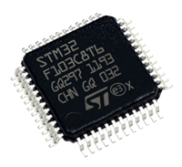
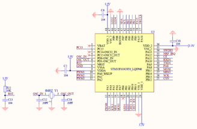
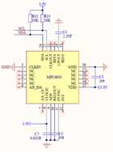
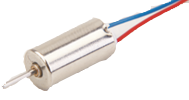
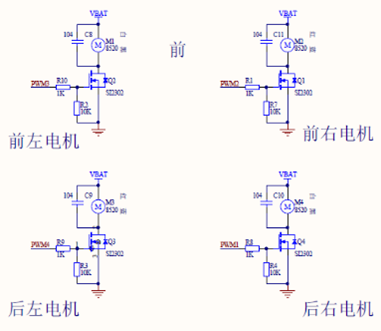
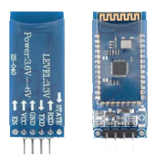
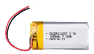
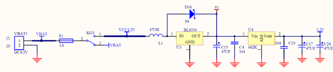

**English | [简体中文](README_cn.md)**
<div id="top"></div>


[![Contributors][contributors-shield]][contributors-url]
[![Forks][forks-shield]][forks-url]
[![Stargazers][stars-shield]][stars-url]
[![Issues][issues-shield]][issues-url]
[![License][license-shield]][license-url]


<!-- PROJECT LOGO -->
<br />
<div align="center">
    <a href="https://github.com/MoonGrt/STM32-Quadcopter">
    
    </a>
<h3 align="center">STM32-Quadcopter</h3>
    <p align="center">
    Design of a quadcopter based on STM32F103C8T6 microcontroller
    <br />
    <a href="https://github.com/MoonGrt/STM32-Quadcopter"><strong>Explore the docs »</strong></a>
    <br />
    <a href="https://github.com/MoonGrt/STM32-Quadcopter">View Demo</a>
    ·
    <a href="https://github.com/MoonGrt/STM32-Quadcopter/issues">Report Bug</a>
    ·
    <a href="https://github.com/MoonGrt/STM32-Quadcopter/issues">Request Feature</a>
    </p>
</div>


<!-- CONTENTS -->
<details open>
  <summary>Contents</summary>
  <ol>
    <li><a href="#file-tree">File Tree</a></li>
    <li>
      <a href="#about-the-project">About The Project</a>
      <ul>
      </ul>
    </li>
    <li><a href="#contributing">Contributing</a></li>
    <li><a href="#license">License</a></li>
    <li><a href="#contact">Contact</a></li>
    <li><a href="#acknowledgments">Acknowledgments</a></li>
  </ol>
</details>


<!-- FILE TREE -->
## File Tree

```
└─ Project
  ├─ Document
  ├─ Hardware
  ├─ Tools
  ├─ LICENSE
  ├─ README.md
  ├─ /images/
  └─ /Software/
    ├─ /Hardware/
    │ ├─ LED.c
    │ ├─ LED.h
    │ ├─ mpu6050.c
    │ └─ mpu6050.h
    ├─ /Math/
    │ ├─ filter.c
    │ ├─ filter.h
    │ ├─ imu.c
    │ ├─ imu.h
    │ ├─ kalman.c
    │ ├─ kalman.h
    │ ├─ myMath.c
    │ ├─ myMath.h
    │ ├─ pid.c
    │ └─ pid.h
    └─ /User/
      ├─ ALL_DATA.h
      ├─ ANO_DT.c
      ├─ ANO_DT.h
      ├─ control.c
      ├─ control.h
      ├─ main.c
      ├─ remote.c
      └─ remote.h
```


<!-- ABOUT THE PROJECT -->
## About The Project

<p style=" margin-top:0px; margin-bottom:0px; margin-left:0px; margin-right:0px; -qt-block-indent:0; text-indent:0px;"><span style=" font-size:14pt; font-weight:600;">Project Overview</span></p>
<p align="center" style=" margin-top:0px; margin-bottom:0px; margin-left:0px; margin-right:0px; -qt-block-indent:0; text-indent:0px;"></p>
<p style=" margin-top:0px; margin-bottom:0px; margin-left:0px; margin-right:0px; -qt-block-indent:0; text-indent:0px;">This quadcopter uses Bluetooth module HC-06 for communication, equipped with four 720 hollow cups as motors, carries a 3.7V-600mA Li-ion battery power supply, and uses MPU6050 as an attitude sensor In order to achieve stable flight, this design applies algorithms such as PID, Kalman filter, quaternion to Euler angle, quaternion normalisation, Lungkuta method</p>
<p style=" margin-top:12px; margin-bottom:12px; margin-left:0px; margin-right:0px; -qt-block-indent:0; text-indent:0px;"><span style=" font-size:14pt; font-weight:600;">Quadcopter Electrical Circuit Design</span></p>
<p align="center" style="-qt-paragraph-type:empty; margin-top:0px; margin-bottom:0px; margin-left:0px; margin-right:0px; -qt-block-indent:0; text-indent:0px;"><br /></p>
<p align="center" style=" margin-top:0px; margin-bottom:0px; margin-left:0px; margin-right:0px; -qt-block-indent:0; text-indent:0px;"></p>
<p style="-qt-paragraph-type:empty; margin-top:0px; margin-bottom:0px; margin-left:0px; margin-right:0px; -qt-block-indent:0; text-indent:0px;"><br /></p>
<p style=" margin-top:0px; margin-bottom:0px; margin-left:0px; margin-right:0px; -qt-block-indent:0; text-indent:0px;"><span style=" font-family:'宋体'; font-weight:600;">1.</span><span style=" font-family:'Times New Roman'; font-size:7pt;"> </span><span style=" font-family:'宋体'; font-weight:600;">STM32f103c8t6 Mini Control Circuit</span></p>
<p style=" margin-top:12px; margin-bottom:12px; margin-left:0px; margin-right:0px; -qt-block-indent:0; text-indent:0px;">This circuit is used to provide the basic operating environment of the STM32F103C8T6 microcontroller When designing the STM32F103C8T6 minimum system circuit, follow the officially provided datasheet and reference circuit diagrams to ensure proper electrical connections and signal integrity Reset: Connect the reset button to the reset pin of the STM32F103C8T6 for manual reset To prevent accidental reset, add a pull-up resistor to the reset pin. Crystal: Connect an 8MHz crystal to the crystal pins (OSC_IN and OSC_OUT) of the STM32F103C8T6 to provide a system clock!</p>
<p align="center" style=" margin-top:0px; margin-bottom:0px; margin-left:0px; margin-right:0px; -qt-block-indent:0; text-indent:0px;"></p>
<p style=" margin-top:0px; margin-bottom:0px; margin-left:0px; margin-right:0px; -qt-block-indent:0; text-indent:0px;"><span style=" font-family:'宋体'; font-weight:600;">2.</span><span style=" font-family:'Times New Roman'; font-size:7pt;"> </span><span style=" font-family:'宋体'; font-weight:600;">6-axis MPU6050 Control Circuit</span></p>
<p style=" margin-top:12px; margin-bottom:12px; margin-left:0px; margin-right:0px; -qt-block-indent:0; text-indent:0px;">The MPU6050 is a six-axis sensor with an integrated three-axis gyroscope and three-axis accelerometer. It consists of stabilised MEMS sensors that measure the angular velocity and acceleration of an object by means of tiny vibrations and the principle of inertia. Gyroscope: The MPU6050's gyroscope measures the angular velocity of an object around three axes (X, Y, and Z) and the rate at which the object rotates around a specific axis per unit time. Accelerometer: The MPU6050's accelerometer measures the acceleration of an object in all three axes, i.e., the rate at which the object's velocity changes per unit time.</p>
<p style=" margin-top:0px; margin-bottom:0px; margin-left:0px; margin-right:0px; -qt-block-indent:0; text-indent:0px;">Power supply: Provides the MPU6050 with an operating voltage of 3.3 V. I2C communication interface: The MPU6050 uses an I2C interface to communicate with the MCU. Connect the SDA (Serial Data Line) and SCL (Serial Clock Line) pins of the MPU6050 to the corresponding pins of the MCU and add pull resistors to ensure that the signal lines remain high during communication. External Power Filtering: To ensure a stable power supply to the MPU6050, appropriate power filtering capacitors are added to reduce power supply noise and interference.</p>
<p align="center" style=" margin-top:0px; margin-bottom:0px; margin-left:0px; margin-right:0px; -qt-block-indent:0; text-indent:0px;"></p>
<p style=" margin-top:0px; margin-bottom:0px; margin-left:0px; margin-right:0px; -qt-block-indent:0; text-indent:0px;"><span style=" font-weight:600;">3.</span><span style=" font-family:'Times New Roman'; font-size:7pt;"> </span><span style=" font-family:'宋体'; font-weight:600;">Motor Control Circuit</span></p>
<p style=" margin-top:12px; margin-bottom:12px; margin-left:0px; margin-right:0px; -qt-block-indent:0; text-indent:0px;">The motor control circuit of the quadcopter is used to control the speed and direction of the four motors. This design uses four 720 hollow cup motors and SI2302 MOSFETs as motor controllers.</p>
<p style=" margin-top:0px; margin-bottom:0px; margin-left:0px; margin-right:0px; -qt-block-indent:0; text-indent:0px;">Control Signal Input: the motor control circuit receives the control signals from the MCU (e.g. STM32F103C8T6).The MCU controls the speed of the motors through PWM signals. The motors are connected to the corresponding pins of the MCU. 4 SI2302 MOSFETs are used as drivers in the motor control circuit for switching and regulating the current. the MCU controls the switching state of the MOSFETs by adjusting the input signals from the drivers, thus controlling the speed of the motors. The positive and negative terminals of the motor are connected to the output pins of the MOSFETs so that current can pass through the motor.</p>
<p align="center" style=" margin-top:0px; margin-bottom:0px; margin-left:0px; margin-right:0px; -qt-block-indent:0; text-indent:0px;"></p>
<p align="center" style=" margin-top:0px; margin-bottom:0px; margin-left:0px; margin-right:0px; -qt-block-indent:0; text-indent:0px;"></p>
<p style=" margin-top:0px; margin-bottom:0px; margin-left:0px; margin-right:0px; -qt-block-indent:0; text-indent:0px;"><span style=" font-family:'宋体'; font-weight:600;">4.</span><span style=" font-family:'Times New Roman'; font-size:7pt;"> </span><span style=" font-family:'宋体'; font-weight:600;">Bluetoooth Module HC-06 Connection</span></p>
<p style=" margin-top:12px; margin-bottom:12px; margin-left:0px; margin-right:0px; -qt-block-indent:0; text-indent:0px;">Bluetooth module HC-06 is a commonly used Bluetooth serial module that can communicate wirelessly with the controller of the flight. By connecting the HC-06 module to the UART1 serial port of the flight controller, data transfer and communication with the mobile phone Bluetooth app is achieved. Connect the TX pin of the HC-06 module to the RX pin of the UART1 of the flight controller in order to realise that the data sent by the module is received to the flight controller via UART1. Also, connect the RX pin of the HC-06 module to the TX pin of UART1 of the flight controller to enable data sent by the flight controller to be transmitted to the HC-06 module via UART1. In addition, connect the power pin of the HC-06 module to a stable 3.3V supply.</p>
<p align="center" style=" margin-top:0px; margin-bottom:0px; margin-left:0px; margin-right:0px; -qt-block-indent:0; text-indent:0px;"></p>
<p style=" margin-top:0px; margin-bottom:0px; margin-left:0px; margin-right:0px; -qt-block-indent:0; text-indent:0px;"><span style=" font-family:'宋体'; font-weight:600;">5、Power Supply-Switching-Boost-Buck Circuit</span></p>
<p style=" margin-top:12px; margin-bottom:12px; margin-left:0px; margin-right:0px; -qt-block-indent:0; text-indent:0px;">The power supply section uses a 3.7V-600mA lithium battery as the power supply. Also, a single-pole, single-throw switch is added to facilitate the switching of the control circuit. This switch is used to turn the circuit on or off, control the connection and disconnection of the power supply, and act as a master switch for the entire flight control design. The 3.7V battery is bucked to 3.3V to provide the proper voltage to the MCU, Bluetooth module, and MPU6050.The buck circuit uses a direct-current-to-direct-current (DC-DC) buck converter: BL8530.</p>
<p align="center" style=" margin-top:0px; margin-bottom:0px; margin-left:0px; margin-right:0px; -qt-block-indent:0; text-indent:0px;"></p>
<p style="-qt-paragraph-type:empty; margin-top:0px; margin-bottom:0px; margin-left:0px; margin-right:0px; -qt-block-indent:0; text-indent:0px;"><br /></p>
<p align="center" style=" margin-top:0px; margin-bottom:0px; margin-left:0px; margin-right:0px; -qt-block-indent:0; text-indent:0px;"></p>
<p style=" margin-top:0px; margin-bottom:0px; margin-left:0px; margin-right:0px; -qt-block-indent:0; text-indent:0px;"><span style=" font-family:'宋体'; font-weight:600;">7.Extended Interface</span></p>
<p style=" margin-top:12px; margin-bottom:12px; margin-left:0px; margin-right:0px; -qt-block-indent:0; text-indent:0px;"><span style=" font-family:'宋体'; font-weight:600;">SWD programming Interface:</span></p>
<p style=" margin-top:12px; margin-bottom:12px; margin-left:0px; margin-right:0px; -qt-block-indent:0; text-indent:0px;">The SWD burner interface is a communication interface for debugging and burning programmes. This design provides the SWD interface to connect to a debugger or programmer for program burning, debugging and updating. Through this interface, it is easy to update the firmware of the flight controller, fix bugs or add new features.</p>
<p style=" margin-top:12px; margin-bottom:12px; margin-left:0px; margin-right:0px; -qt-block-indent:0; text-indent:0px;"><span style=" font-family:'宋体'; font-weight:600;">Serial Data Output Interface:</span></p>
<p style=" margin-top:12px; margin-bottom:12px; margin-left:0px; margin-right:0px; -qt-block-indent:0; text-indent:0px;">The serial data output interface is designed to facilitate the transmission of aircraft status and other data to the host computer for monitoring and analysis. Through the serial data output interface, the flight controller can send real-time flight attitude, sensor data, flight parameters and other information to the host computer for monitoring and analysis. The host computer can use the corresponding serial communication protocol to receive and parse these data for real-time display of aircraft status, debugging parameters or data logging.</p>
<p style="-qt-paragraph-type:empty; margin-top:0px; margin-bottom:0px; margin-left:0px; margin-right:0px; -qt-block-indent:0; text-indent:0px;"><br /></p>
<p style="-qt-paragraph-type:empty; margin-top:12px; margin-bottom:12px; margin-left:0px; margin-right:0px; -qt-block-indent:0; text-indent:0px;"><br /></p>
<p style="-qt-paragraph-type:empty; margin-top:12px; margin-bottom:12px; margin-left:0px; margin-right:0px; -qt-block-indent:0; text-indent:0px;"><br /></p>
<p style="-qt-paragraph-type:empty; margin-top:12px; margin-bottom:12px; margin-left:0px; margin-right:0px; -qt-block-indent:0; text-indent:0px;"><br /></p>
<p align="center" style="-qt-paragraph-type:empty; margin-top:0px; margin-bottom:0px; margin-left:0px; margin-right:0px; -qt-block-indent:0; text-indent:0px;"><br /></p>
<p style="-qt-paragraph-type:empty; margin-top:0px; margin-bottom:0px; margin-left:0px; margin-right:0px; -qt-block-indent:0; text-indent:0px;"><br /></p></body></html>
<p align="right">(<a href="#top">top</a>)</p>


<!-- CONTRIBUTING -->
## Contributing

Contributions are what make the open source community such an amazing place to learn, inspire, and create. Any contributions you make are **greatly appreciated**.
If you have a suggestion that would make this better, please fork the repo and create a pull request. You can also simply open an issue with the tag "enhancement".
Don't forget to give the project a star! Thanks again!
1. Fork the Project
2. Create your Feature Branch (`git checkout -b feature/AmazingFeature`)
3. Commit your Changes (`git commit -m 'Add some AmazingFeature'`)
4. Push to the Branch (`git push origin feature/AmazingFeature`)
5. Open a Pull Request
<p align="right">(<a href="#top">top</a>)</p>


<!-- LICENSE -->
## License

Distributed under the MIT License. See `LICENSE` for more information.
<p align="right">(<a href="#top">top</a>)</p>


<!-- CONTACT -->
## Contact

MoonGrt - 1561145394@qq.com
Project Link: [MoonGrt/STM32-Quadcopter](https://github.com/MoonGrt/STM32-Quadcopter)
<p align="right">(<a href="#top">top</a>)</p>


<!-- ACKNOWLEDGMENTS -->
## Acknowledgments

* [Choose an Open Source License](https://choosealicense.com)
* [GitHub Emoji Cheat Sheet](https://www.webpagefx.com/tools/emoji-cheat-sheet)
* [Malven's Flexbox Cheatsheet](https://flexbox.malven.co/)
* [Malven's Grid Cheatsheet](https://grid.malven.co/)
* [Img Shields](https://shields.io)
* [GitHub Pages](https://pages.github.com)
* [Font Awesome](https://fontawesome.com)
* [React Icons](https://react-icons.github.io/react-icons/search)
<p align="right">(<a href="#top">top</a>)</p>


<!-- MARKDOWN LINKS & IMAGES -->
<!-- https://www.markdownguide.org/basic-syntax/#reference-style-links -->
[contributors-shield]: https://img.shields.io/github/contributors/MoonGrt/STM32-Quadcopter.svg?style=for-the-badge
[contributors-url]: https://github.com/MoonGrt/STM32-Quadcopter/graphs/contributors
[forks-shield]: https://img.shields.io/github/forks/MoonGrt/STM32-Quadcopter.svg?style=for-the-badge
[forks-url]: https://github.com/MoonGrt/STM32-Quadcopter/network/members
[stars-shield]: https://img.shields.io/github/stars/MoonGrt/STM32-Quadcopter.svg?style=for-the-badge
[stars-url]: https://github.com/MoonGrt/STM32-Quadcopter/stargazers
[issues-shield]: https://img.shields.io/github/issues/MoonGrt/STM32-Quadcopter.svg?style=for-the-badge
[issues-url]: https://github.com/MoonGrt/STM32-Quadcopter/issues
[license-shield]: https://img.shields.io/github/license/MoonGrt/STM32-Quadcopter.svg?style=for-the-badge
[license-url]: https://github.com/MoonGrt/STM32-Quadcopter/blob/master/LICENSE

