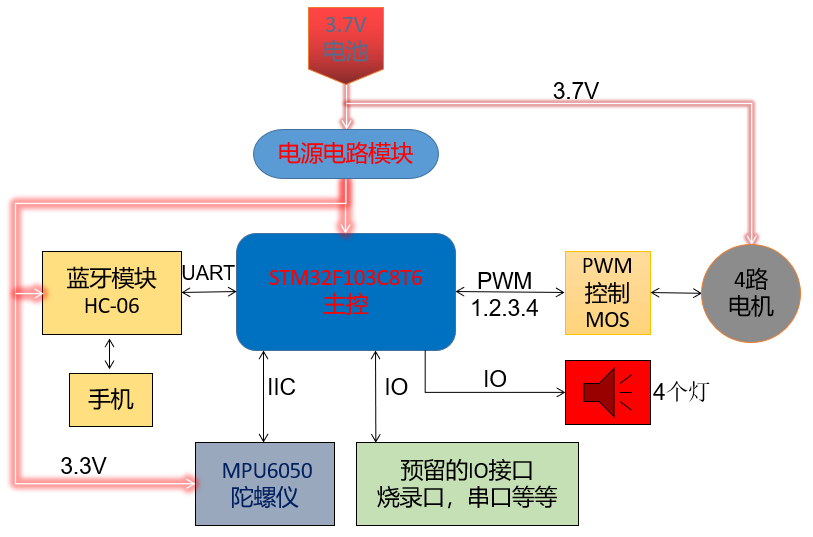

**简体中文 | [English](README.md)**
<div id="top"></div>

[![Contributors][contributors-shield]][contributors-url]
[![Forks][forks-shield]][forks-url]
[![Stargazers][stars-shield]][stars-url]
[![Issues][issues-shield]][issues-url]
[![License][license-shield]][license-url]


<!-- PROJECT LOGO -->
<br />
<div align="center">
    <a href="https://github.com/MoonGrt/STM32-Quadcopter">
    
    </a>
<h3 align="center">STM32-Quadcopter</h3>
    <p align="center">
    一款基于STM32F103C8T6微控制器的四轴飞行器的设计
    <br />
    <a href="https://github.com/MoonGrt/STM32-Quadcopter"><strong>浏览文档 »</strong></a>
    <br />
    <a href="https://github.com/MoonGrt/STM32-Quadcopter">查看 Demo</a>
    ·
    <a href="https://github.com/MoonGrt/STM32-Quadcopter/issues">反馈 Bug</a>
    ·
    <a href="https://github.com/MoonGrt/STM32-Quadcopter/issues">请求新功能</a>
    </p>
</div>


<!-- CONTENTS -->
<details open>
  <summary>目录</summary>
  <ol>
    <li><a href="#文件树">文件树</a></li>
    <li>
      <a href="#关于本项目">关于本项目</a>
      <ul>
      </ul>
    </li>
    <li><a href="#贡献">贡献</a></li>
    <li><a href="#许可证">许可证</a></li>
    <li><a href="#联系我们">联系我们</a></li>
    <li><a href="#致谢">致谢</a></li>
  </ol>
</details>


<!-- 文件树 -->
## 文件树

```
└─ Project
  ├─ Document
  ├─ Hardware
  ├─ Tools
  ├─ LICENSE
  ├─ README.md
  ├─ /images/
  └─ /Software/
    ├─ /Hardware/
    │ ├─ LED.c
    │ ├─ LED.h
    │ ├─ mpu6050.c
    │ └─ mpu6050.h
    ├─ /Math/
    │ ├─ filter.c
    │ ├─ filter.h
    │ ├─ imu.c
    │ ├─ imu.h
    │ ├─ kalman.c
    │ ├─ kalman.h
    │ ├─ myMath.c
    │ ├─ myMath.h
    │ ├─ pid.c
    │ └─ pid.h
    └─ /User/
      ├─ ALL_DATA.h
      ├─ ANO_DT.c
      ├─ ANO_DT.h
      ├─ control.c
      ├─ control.h
      ├─ main.c
      ├─ remote.c
      └─ remote.h
```


<!-- 关于本项目 -->
## 关于本项目

<h1 style=" margin-top:18px; margin-bottom:12px; margin-left:0px; margin-right:0px; -qt-block-indent:0; text-indent:0px;"><span style=" font-size:14pt; font-weight:600;">一、项目概述</span><span style=" font-size:xx-large; font-weight:600;"> </span></h1>

<p align="center" style=" margin-top:0px; margin-bottom:0px; margin-left:0px; margin-right:0px; -qt-block-indent:0; text-indent:0px;"></p>
<p style=" margin-top:0px; margin-bottom:0px; margin-left:0px; margin-right:0px; -qt-block-indent:0; text-indent:0px;">一款基于STM32F103C8T6微控制器的四轴飞行器的设计。该四轴飞行器采用了蓝牙模块HC-06进行通信，配备了4个720空心杯作为电机，搭载了3.7V-600mA锂电池供电，并使用MPU6050作为姿态传感器。为了实现稳定的飞行，本设计运用了PID、卡尔曼滤波、四元数转欧拉角、四元数归一化、龙格库塔法等算法。</p>
<p style=" margin-top:12px; margin-bottom:12px; margin-left:0px; margin-right:0px; -qt-block-indent:0; text-indent:0px;"><span style=" font-size:14pt; font-weight:600;">二、四旋翼电气电路设计</span> </p>
<p align="center" style=" margin-top:0px; margin-bottom:0px; margin-left:0px; margin-right:0px; -qt-block-indent:0; text-indent:0px;"></p>
<p style=" margin-top:0px; margin-bottom:0px; margin-left:0px; margin-right:0px; -qt-block-indent:0; text-indent:0px;"><span style=" font-family:'宋体'; font-weight:600;">1.</span><span style=" font-family:'Times New Roman'; font-size:7pt;"> </span><span style=" font-family:'宋体'; font-weight:600;">STM32f103c8t6最小系统电路</span> </p>
<p style=" margin-top:12px; margin-bottom:12px; margin-left:0px; margin-right:0px; -qt-block-indent:0; text-indent:0px;"><span style=" font-family:'宋体';">该电路用于提供STM32F103C8T6微控制器的基本工作环境。在设计STM32F103C8T6最小系统电路时，遵循官方提供的数据手册和参考电路图，以确保正确的电气连接和信号完整性。复位：连接复位按钮到STM32F103C8T6的复位引脚以实现手动复位。为了防止意外复位，在复位引脚上加上一个上拉电阻。晶振：将8MHz的晶振连接到STM32F103C8T6的晶振引脚（OSC_IN和OSC_OUT），以提供系统时钟。</span> </p>
<p align="center" style=" margin-top:0px; margin-bottom:0px; margin-left:0px; margin-right:0px; -qt-block-indent:0; text-indent:0px;"></p>
<p style=" margin-top:0px; margin-bottom:0px; margin-left:0px; margin-right:0px; -qt-block-indent:0; text-indent:0px;"><span style=" font-family:'宋体'; font-weight:600;">2.</span><span style=" font-family:'Times New Roman'; font-size:7pt;"> </span><span style=" font-family:'宋体'; font-weight:600;">6轴陀螺仪MPU6050控制电路</span> </p>
<p style=" margin-top:12px; margin-bottom:12px; margin-left:0px; margin-right:0px; -qt-block-indent:0; text-indent:0px;"><span style=" font-family:'宋体';">MPU6050是一种集成了三轴陀螺仪和三轴加速度计的六轴传感器。它由稳定的MEMS传感器组成，通过微小的振动和惯性原理来测量物体的角速度和加速度。陀螺仪：MPU6050的陀螺仪测量物体绕三个轴（X、Y和Z轴）的角速度，及物体在单位时间内绕特定轴旋转的速率。加速度计：MPU6050的加速度计测量物体在三个轴上的加速度，即物体在单位时间内速度变化的速率。</span> </p>
<p style=" margin-top:12px; margin-bottom:12px; margin-left:0px; margin-right:0px; -qt-block-indent:0; text-indent:0px;"><span style=" font-family:'宋体';">供电：为MPU6050提供工作电压3.3V。I2C通信接口：MPU6050使用I2C接口与MCU进行通信。连接MPU6050的SDA（串行数据线）和SCL（串行时钟线）引脚到MCU的相应引脚，并加上拉电阻，以确保信号线在通信过程中保持高电平。外部电源滤波：为了保证MPU6050的电源供应稳定，加入了适当的电源滤波电容，以减小电源噪声和干扰。</span> </p>
<p align="center" style=" margin-top:0px; margin-bottom:0px; margin-left:0px; margin-right:0px; -qt-block-indent:0; text-indent:0px;"></p>
<p style=" margin-top:0px; margin-bottom:0px; margin-left:0px; margin-right:0px; -qt-block-indent:0; text-indent:0px;"><span style=" font-weight:600;">3.</span><span style=" font-family:'Times New Roman'; font-size:7pt;"> </span><span style=" font-family:'宋体'; font-weight:600;">电机控制电路</span> </p>
<p style=" margin-top:12px; margin-bottom:12px; margin-left:0px; margin-right:0px; -qt-block-indent:0; text-indent:0px;"><span style=" font-family:'宋体';">四旋翼飞行器的电机控制电路用于控制四个电机的转速和方向。本设计使用了四个720空心杯电机和SI2302 MOSFET作为电机控制器。</span> </p>
<p style=" margin-top:12px; margin-bottom:12px; margin-left:0px; margin-right:0px; -qt-block-indent:0; text-indent:0px;"><span style=" font-family:'宋体';">控制信号输入：电机控制电路接收来自MCU（如STM32F103C8T6）的控制信号。MCU通过PWM信号来控制电机的转速。电机分别都连接到MCU的相应引脚。4个SI2302 MOSFET被用作电机控制电路中的驱动器，用于开关和调节电流。MCU通过调节驱动器的输入信号来控制MOSFET的开关状态，从而控制电机的转速。电机的正极和负极分别连接到MOS管的输出引脚，以便电流能够通过电机。</span> </p>
<p align="center" style=" margin-top:0px; margin-bottom:0px; margin-left:0px; margin-right:0px; -qt-block-indent:0; text-indent:0px;"></p>
<p align="center" style=" margin-top:0px; margin-bottom:0px; margin-left:0px; margin-right:0px; -qt-block-indent:0; text-indent:0px;"></p>
<p style=" margin-top:0px; margin-bottom:0px; margin-left:0px; margin-right:0px; -qt-block-indent:0; text-indent:0px;"><span style=" font-family:'宋体'; font-weight:600;">4.</span><span style=" font-family:'Times New Roman'; font-size:7pt;"> </span><span style=" font-family:'宋体'; font-weight:600;">蓝牙模块HC-06连接UART1</span> </p>
<p style=" margin-top:12px; margin-bottom:12px; margin-left:0px; margin-right:0px; -qt-block-indent:0; text-indent:0px;"><span style=" font-family:'宋体';">蓝牙模块HC-06是一种常用的蓝牙串口模块，可以与飞行器的控制器进行无线通信。通过将HC-06模块连接到飞行控制器的UART1串口，实现与手机蓝牙app之间的数据传输和通信。将HC-06模块的TX引脚连接到飞行控制器的UART1的RX引脚，以实现模块发送的数据通过UART1接收到飞行控制器。同时，将HC-06模块的RX引脚连接到飞行控制器的UART1的TX引脚，以实现飞行控制器发送的数据通过UART1传输到HC-06模块。此外，将HC-06模块的电源引脚连接到稳定的3.3V电源上。</span> </p>
<p align="center" style=" margin-top:0px; margin-bottom:0px; margin-left:0px; margin-right:0px; -qt-block-indent:0; text-indent:0px;"></p>
<p style=" margin-top:0px; margin-bottom:0px; margin-left:0px; margin-right:0px; -qt-block-indent:0; text-indent:0px;"><span style=" font-family:'宋体'; font-weight:600;">5、电源-开关-升压-降压电路（3.7V-600mA锂电池）</span> </p>
<p style=" margin-top:12px; margin-bottom:12px; margin-left:0px; margin-right:0px; -qt-block-indent:0; text-indent:0px;"><span style=" font-family:'宋体';">电源部分使用一块3.7V-600mA锂电池作为供电源。同时，为了方便控制电路的开关，添加一个单刀单掷开关。该开关用于打开或关闭电路，控制电源的连接和断开，作为整个飞控设计的总开关。将3.7V电池降压到3.3V，提供适当的电压给MCU、蓝牙模块、MPU6050。降压电路采用直流-直流（DC-DC）降压转换器：BL8530。</span> </p>
<p align="center" style=" margin-top:0px; margin-bottom:0px; margin-left:0px; margin-right:0px; -qt-block-indent:0; text-indent:0px;"></p>
<p style="-qt-paragraph-type:empty; margin-top:0px; margin-bottom:0px; margin-left:0px; margin-right:0px; -qt-block-indent:0; text-indent:0px;"><br /></p>
<p align="center" style=" margin-top:0px; margin-bottom:0px; margin-left:0px; margin-right:0px; -qt-block-indent:0; text-indent:0px;"></p>
<p style=" margin-top:0px; margin-bottom:0px; margin-left:0px; margin-right:0px; -qt-block-indent:0; text-indent:0px;"><span style=" font-family:'宋体'; font-weight:600;">7.扩展输出接口电路</span> </p>
<p style=" margin-top:12px; margin-bottom:12px; margin-left:0px; margin-right:0px; -qt-block-indent:0; text-indent:0px;"><span style=" font-family:'宋体'; font-weight:600;">SWD烧录程序接口：</span> </p>
<p style=" margin-top:12px; margin-bottom:12px; margin-left:0px; margin-right:0px; -qt-block-indent:0; text-indent:0px;"><span style=" font-family:'宋体';">SWD烧录程序接口是一种用于调试和烧录程序的通信接口。本设计提供SWD接口来连接调试器或编程器，以便进行程序的烧录、调试和更新。通过该接口，可以方便地更新飞行控制器的固件，修复漏洞或添加新的功能。</span> </p>
<p style=" margin-top:12px; margin-bottom:12px; margin-left:0px; margin-right:0px; -qt-block-indent:0; text-indent:0px;"><span style=" font-family:'宋体'; font-weight:600;">串口数据输出接口：</span> </p>
<p style=" margin-top:12px; margin-bottom:12px; margin-left:0px; margin-right:0px; -qt-block-indent:0; text-indent:0px;"><span style=" font-family:'宋体';">串口数据输出接口是为了方便将飞机状态和其他数据传输到上位机进行监视和分析而设计的。通过串口数据输出接口，飞行控制器可以将实时的飞行姿态、传感器数据、飞行参数等信息发送到上位机，进行监测和分析。上位机可以使用相应的串口通信协议来接收并解析这些数据，以实时显示飞机状态、调试参数或进行数据记录。</span> </p>
<p style="-qt-paragraph-type:empty; margin-top:0px; margin-bottom:0px; margin-left:0px; margin-right:0px; -qt-block-indent:0; text-indent:0px;"><br /></p>
<p style="-qt-paragraph-type:empty; margin-top:12px; margin-bottom:12px; margin-left:0px; margin-right:0px; -qt-block-indent:0; text-indent:0px;"><br /></p>
<p style="-qt-paragraph-type:empty; margin-top:12px; margin-bottom:12px; margin-left:0px; margin-right:0px; -qt-block-indent:0; text-indent:0px;"><br /></p>
<p style="-qt-paragraph-type:empty; margin-top:12px; margin-bottom:12px; margin-left:0px; margin-right:0px; -qt-block-indent:0; text-indent:0px;"><br /></p></body></html>
<p align="right">(<a href="#top">top</a>)</p>


<!-- 贡献 -->
## 贡献

贡献让开源社区成为了一个非常适合学习、互相激励和创新的地方。你所做出的任何贡献都是**受人尊敬**的。

如果你有好的建议，请复刻（fork）本仓库并且创建一个拉取请求（pull request）。你也可以简单地创建一个议题（issue），并且添加标签「enhancement」。不要忘记给项目点一个 star！再次感谢！

1. 复刻（Fork）本项目
2. 创建你的 Feature 分支 (`git checkout -b feature/AmazingFeature`)
3. 提交你的变更 (`git commit -m 'Add some AmazingFeature'`)
4. 推送到该分支 (`git push origin feature/AmazingFeature`)
5. 创建一个拉取请求（Pull Request）
<p align="right">(<a href="#top">top</a>)</p>


<!-- 许可证 -->
## 许可证

根据 MIT 许可证分发。打开 [LICENSE](LICENSE) 查看更多内容。
<p align="right">(<a href="#top">top</a>)</p>


<!-- 联系我们 -->
## 联系我们

MoonGrt - 1561145394@qq.com
Project Link: [MoonGrt/STM32-Quadcopter](https://github.com/MoonGrt/STM32-Quadcopter)

<p align="right">(<a href="#top">top</a>)</p>


<!-- 致谢 -->
## 致谢

* [Choose an Open Source License](https://choosealicense.com)
* [GitHub Emoji Cheat Sheet](https://www.webpagefx.com/tools/emoji-cheat-sheet)
* [Malven's Flexbox Cheatsheet](https://flexbox.malven.co/)
* [Malven's Grid Cheatsheet](https://grid.malven.co/)
* [Img Shields](https://shields.io)
* [GitHub Pages](https://pages.github.com)
* [Font Awesome](https://fontawesome.com)
* [React Icons](https://react-icons.github.io/react-icons/search)
<p align="right">(<a href="#top">top</a>)</p>


<!-- MARKDOWN LINKS & IMAGES -->
<!-- https://www.markdownguide.org/basic-syntax/#reference-style-links -->
[contributors-shield]: https://img.shields.io/github/contributors/MoonGrt/STM32-Quadcopter.svg?style=for-the-badge
[contributors-url]: https://github.com/MoonGrt/STM32-Quadcopter/graphs/contributors
[forks-shield]: https://img.shields.io/github/forks/MoonGrt/STM32-Quadcopter.svg?style=for-the-badge
[forks-url]: https://github.com/MoonGrt/STM32-Quadcopter/network/members
[stars-shield]: https://img.shields.io/github/stars/MoonGrt/STM32-Quadcopter.svg?style=for-the-badge
[stars-url]: https://github.com/MoonGrt/STM32-Quadcopter/stargazers
[issues-shield]: https://img.shields.io/github/issues/MoonGrt/STM32-Quadcopter.svg?style=for-the-badge
[issues-url]: https://github.com/MoonGrt/STM32-Quadcopter/issues
[license-shield]: https://img.shields.io/github/license/MoonGrt/STM32-Quadcopter.svg?style=for-the-badge
[license-url]: https://github.com/MoonGrt/STM32-Quadcopter/blob/master/LICENSE

